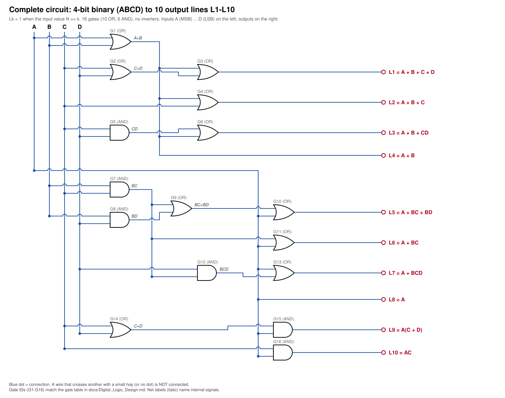
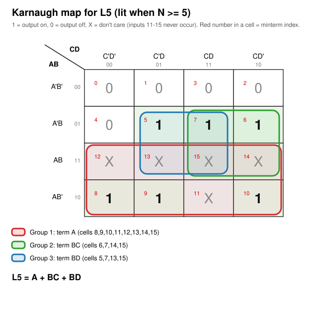
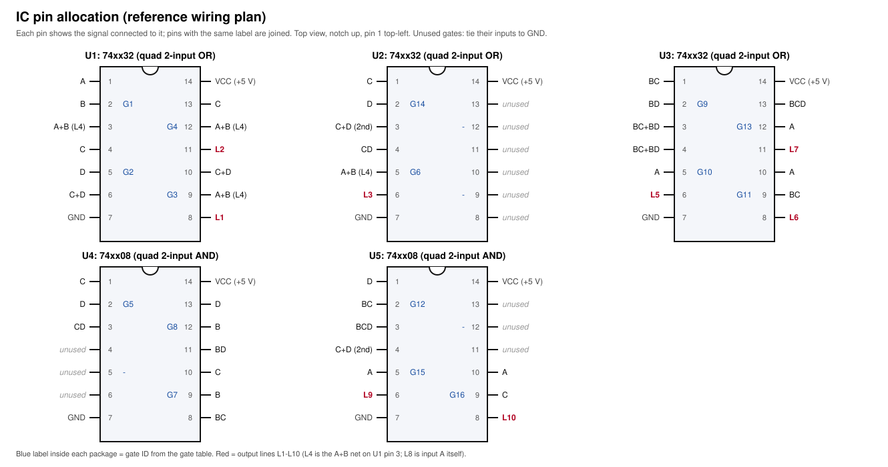

# 4-bit Binary → Decimal (0–10) Converter

A combinational digital-logic project that converts a **4-bit binary input (0000 – 1010)** into a **decimal reading from 0 to 10**, shown as a bar of lit output lines **L1 … L10** (input value *N* lights exactly *N* lines). It was designed with truth tables and Karnaugh maps and built from **16 two-input AND/OR gates in 5 standard ICs, with no inverters**.



## Contents
[Objectives](#objectives) · [Features](#features-and-conversion-range) · [Working principle](#working-principle) · [Truth table](#truth-table) · [Boolean equations](#simplified-boolean-equations) · [K-maps](#k-map-method) · [Circuit diagrams](#circuit-diagrams) · [Components](#tools-and-components) · [Files](#repository-structure) · [Reproduce](#how-to-understand-or-reproduce-the-circuit) · [Verification](#verification) · [Source and assumptions](#source-material-and-assumptions) · [Limitations](#limitations-and-possible-improvements)

## Objectives
* Convert a valid 4-bit binary number (0–10) into a decimal indication.
* Derive each output from a truth table and minimise it with a Karnaugh map.
* Implement all ten outputs with as few gates as practical and document the design so that it can be rebuilt and checked.

## Features and conversion range
* **Input:** 4 bits, `ABCD` (A = MSB). **Valid range:** 0 – 10 (`0000` – `1010`).
* **Output:** 10 lines, L1 … L10. The decimal value equals the number of lit lines.
* **Logic:** 10 OR + 6 AND gates, 5 packages (3 × quad OR, 2 × quad AND), no NOT gates, at most 3 gate levels.
* Every output expression is simple: the most complex is `L5 = A + BC + BD`.
* Inputs 11 – 15 are don't-cares (their behaviour is documented in the report).

## Working principle
The output pattern is a "thermometer" code: **Lk is on whenever N ≥ k.** Each output is therefore a threshold detector on the 4-bit input, e.g. L8 is just `A` (N ≥ 8 means the 8s bit is set) and L10 is `AC` (the only valid input with A and C both 1 is 1010). Because inputs 11–15 never occur, they are treated as don't-cares, which lets every function be written with uncomplemented inputs only — no inverters are required. Higher outputs reuse the sub-terms of lower ones (`A+B`, `BC`), so the gates are shared.

| N | ABCD | L1 … L10 (● = on) |
|:-:|:-:|:--|
| 0 | `0000` | `○○○○○○○○○○` |
| 1 | `0001` | `●○○○○○○○○○` |
| 2 | `0010` | `●●○○○○○○○○` |
| 3 | `0011` | `●●●○○○○○○○` |
| 4 | `0100` | `●●●●○○○○○○` |
| 5 | `0101` | `●●●●●○○○○○` |
| 6 | `0110` | `●●●●●●○○○○` |
| 7 | `0111` | `●●●●●●●○○○` |
| 8 | `1000` | `●●●●●●●●○○` |
| 9 | `1001` | `●●●●●●●●●○` |
| 10 | `1010` | `●●●●●●●●●●` |

## Truth table
Valid rows (full 16-row table, including the don't-care rows, in [`docs/Digital_Logic_Design.md`](docs/Digital_Logic_Design.md#4-truth-table) and [`data/truth_table.csv`](data/truth_table.csv)):

| N | A | B | C | D | L1 | L2 | L3 | L4 | L5 | L6 | L7 | L8 | L9 | L10 |
|:-:|:-:|:-:|:-:|:-:|:-:|:-:|:-:|:-:|:-:|:-:|:-:|:-:|:-:|:-:|
| 0 | 0 | 0 | 0 | 0 | 0 | 0 | 0 | 0 | 0 | 0 | 0 | 0 | 0 | 0 |
| 1 | 0 | 0 | 0 | 1 | 1 | 0 | 0 | 0 | 0 | 0 | 0 | 0 | 0 | 0 |
| 2 | 0 | 0 | 1 | 0 | 1 | 1 | 0 | 0 | 0 | 0 | 0 | 0 | 0 | 0 |
| 3 | 0 | 0 | 1 | 1 | 1 | 1 | 1 | 0 | 0 | 0 | 0 | 0 | 0 | 0 |
| 4 | 0 | 1 | 0 | 0 | 1 | 1 | 1 | 1 | 0 | 0 | 0 | 0 | 0 | 0 |
| 5 | 0 | 1 | 0 | 1 | 1 | 1 | 1 | 1 | 1 | 0 | 0 | 0 | 0 | 0 |
| 6 | 0 | 1 | 1 | 0 | 1 | 1 | 1 | 1 | 1 | 1 | 0 | 0 | 0 | 0 |
| 7 | 0 | 1 | 1 | 1 | 1 | 1 | 1 | 1 | 1 | 1 | 1 | 0 | 0 | 0 |
| 8 | 1 | 0 | 0 | 0 | 1 | 1 | 1 | 1 | 1 | 1 | 1 | 1 | 0 | 0 |
| 9 | 1 | 0 | 0 | 1 | 1 | 1 | 1 | 1 | 1 | 1 | 1 | 1 | 1 | 0 |
| 10 | 1 | 0 | 1 | 0 | 1 | 1 | 1 | 1 | 1 | 1 | 1 | 1 | 1 | 1 |

## Simplified Boolean equations
| Output | Lit when | Simplified expression | Gates in its own cone |
|:-:|:-:|:--|:-:|
| L1 | N ≥ 1 | **A + B + C + D** | 3 |
| L2 | N ≥ 2 | **A + B + C** | 2 |
| L3 | N ≥ 3 | **A + B + CD** | 3 |
| L4 | N ≥ 4 | **A + B** | 1 |
| L5 | N ≥ 5 | **A + BC + BD** | 4 |
| L6 | N ≥ 6 | **A + BC** | 2 |
| L7 | N ≥ 7 | **A + BCD** | 3 |
| L8 | N ≥ 8 | **A** | wire (no gate) |
| L9 | N ≥ 9 | **A(C + D)** | 2 |
| L10 | N ≥ 10 | **AC** | 1 |

(`L4 = A + B` is taken from the same gate that feeds L1, L2 and L3; `L8 = A` is the input wire itself.)

## K-map method
Each output has its own 4×4 Karnaugh map (rows `AB` = 00, 01, 11, 10; columns `CD` = 00, 01, 11, 10). Cells 0 … 10 come from the truth table and cells 11 … 15 are marked **X** (don't care). Rectangles of 1/2/4/8 cells containing only 1s and Xs give product terms, and the OR of those terms is the output. Example, **L5 = A + BC + BD**: the octet `A` covers 8–15, the quad `BC` covers 6, 7, 14, 15 and the quad `BD` covers 5, 7, 13, 15.



All ten maps with grouping steps and explanations are in [Section 6 of the design report](docs/Digital_Logic_Design.md#6-karnaugh-maps-one-per-output); the pictures are in [`diagrams/kmaps/`](diagrams/kmaps).

## Circuit diagrams
**Complete circuit** (shown at the top of this page): [`diagrams/circuits/complete_circuit.svg`](diagrams/circuits/complete_circuit.svg). Dots are connections; a wire crossing another with a small hop is not connected.

**IC pin allocation** (3 × 74xx32 quad OR, 2 × 74xx08 quad AND):



**Individual output circuits:** [L1](diagrams/circuits/L1_circuit.svg) · [L2](diagrams/circuits/L2_circuit.svg) · [L3](diagrams/circuits/L3_circuit.svg) · [L4](diagrams/circuits/L4_circuit.svg) · [L5](diagrams/circuits/L5_circuit.svg) · [L6](diagrams/circuits/L6_circuit.svg) · [L7](diagrams/circuits/L7_circuit.svg) · [L8](diagrams/circuits/L8_circuit.svg) · [L9](diagrams/circuits/L9_circuit.svg) · [L10](diagrams/circuits/L10_circuit.svg). PNG copies are in [`diagrams/png/`](diagrams/png).

## Tools and components
| Item | Qty | Notes |
|:--|:-:|:--|
| Quad 2-input OR, 74xx32 pin-out | 3 | Part type inferred from the OR labels and output pins 3/6/8/11 in the original sketch; exact part number not printed in the PDF |
| Quad 2-input AND, 74xx08 pin-out | 2 | As above |
| 4 binary inputs (e.g. switches) | 4 | Not shown in the PDF |
| 10 output indicators (e.g. LEDs with resistors) | 10 | Not shown in the PDF; the PDF only labels the output lines L1–L10 |
| +5 V supply (VCC = pin 14, GND = pin 7) | 1 | Standard for the listed ICs |

Design/verification tools: pencil-and-paper K-maps (original), Python 3 (standard library) for verification and diagram generation, `cairosvg` (optional) for PNG export.

## Repository structure
```
Binary-to-Decimal-Converter/
├── README.md                       this file
├── data/
│   └── truth_table.csv             full 16-row truth table (X = don't care)
├── diagrams/
│   ├── kmaps/                      L1_kmap.svg … L10_kmap.svg (grouped K-maps)
│   ├── circuits/                   complete_circuit.svg, L1…L10_circuit.svg, ic_pin_allocation.svg
│   └── png/                        PNG copies of every diagram
├── docs/
│   ├── Digital_Logic_Design.md     full report: derivations, K-maps, gates, ICs, verification
│   ├── verification_log.txt        output of tools/verify_design.py
│   └── original/
│       └── CSE260-Project-1.pdf    the original project PDF, unmodified
└── tools/
    ├── design_data.py              truth table, expressions, K-map groups, netlist, IC allocation
    ├── generate_diagrams.py        builds all SVG/PNG diagrams from design_data.py
    └── verify_design.py            exhaustive self-check of the whole design
```

## How to understand or reproduce the circuit
1. Read the truth table above: the number of lit outputs equals the binary input value.
2. For any output, open its K-map in `diagrams/kmaps/` and its circuit in `diagrams/circuits/` — the groups on the map are the AND terms feeding the final OR gate.
3. To build it, place the five ICs as in [`ic_pin_allocation.svg`](diagrams/circuits/ic_pin_allocation.svg), connect VCC/GND, tie unused gate inputs to GND, and join pins that carry the same signal name (the full gate and pin table is in [Section 9 of the report](docs/Digital_Logic_Design.md#9-ic-level-implementation)).
4. Test by applying `0000` to `1010` and checking that exactly N lines (L1 first) light up.
5. In software: `python3 tools/verify_design.py` re-runs every check; `python3 tools/generate_diagrams.py --png` regenerates the diagrams.

## Verification
`tools/verify_design.py` checks, with no third-party packages: the truth table against the rule *Lk = 1 ⇔ N ≥ k*; every PDF expression against the table; every K-map group (valid, prime, irredundant); the gate netlist for all 16 inputs; a **netlist extracted from the drawn circuit geometry** for the complete and the ten individual diagrams; and the IC pin allocation. All checks pass (see [`docs/verification_log.txt`](docs/verification_log.txt)).

## Source material and assumptions
* The truth table, the ten simplified expressions, the schematic and the IC sketch come from [`docs/original/CSE260-Project-1.pdf`](docs/original/CSE260-Project-1.pdf). That PDF was the only project file supplied; no HDL, simulator or other source files existed, so none are included.
* The PDF contains K-maps only for L1 and L2; the other eight were completed from the truth table and agree with the PDF's printed expressions.
* The IC pin table is a reference allocation consistent with the schematic and with the output labels legible in the PDF's IC sketch. The report states which entries are labelled in the PDF and which are inferred.
* Switches, LEDs, resistors and power wiring are not shown in the PDF and are not specified here.

## Limitations and possible improvements
* The result is a bar of lit lines, not a numeral.
* Inputs 11–15 give unflagged patterns (11/14/15 light all ten lines, 13 lights nine, 12 lights eight). An error flag `E = A(B + CD)` would cost two gates and reuse the existing `CD` gate.
* Two identical `C + D` OR gates (L1 and L9) could be merged into one.
* No input debouncing or output current-limiting is described in the source.
* A simulator model (Logisim-evolution or Verilog) would make the design runnable without hardware.
