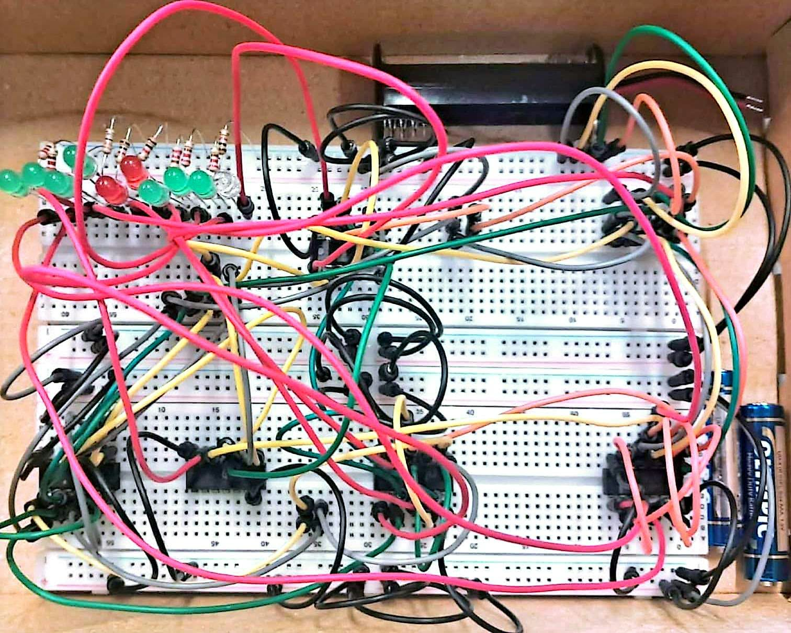

# 4-bit Binary → Decimal (0–10) Converter

A combinational digital-logic project that converts a **4-bit binary input (0000 – 1010)** into a **decimal reading from 0 to 10**, shown as a bar of lit output lines **L1 … L10** (input value *N* lights exactly *N* lines). It was designed with truth tables and Karnaugh maps and built from **16 two-input AND/OR gates in 5 standard ICs, with no inverters**.


## Contents
[Objectives](#objectives) · [Features](#features-and-conversion-range) · [Working principle](#working-principle) · [Truth table](#truth-table) · [Boolean equations](#simplified-boolean-equations) · [K-maps](#k-map-method) · [Circuit diagrams](#circuit-diagrams) · [Components](#tools-and-components) · [Files](#repository-structure) · [Limitations](#limitations-and-possible-improvements)

## Objectives
* Convert a valid 4-bit binary number (0–10) into a decimal indication.
* Derive each output from a truth table and minimise it with a Karnaugh map.
* Implement all ten outputs with as few gates as practical and document the design so that it can be rebuilt and checked.

## Features and conversion range
* **Input:** 4 bits, `ABCD` (A = MSB). **Valid range:** 0 – 10 (`0000` – `1010`).
* **Output:** 10 lines, L1 … L10. The decimal value equals the number of lit lines.
* **Logic:** 10 OR + 6 AND gates, 5 packages (3 × quad OR, 2 × quad AND), no NOT gates, at most 3 gate levels.
* Every output expression is simple: the most complex is `L5 = A + BC + BD`.
* Inputs 11 – 15 are don't-cares (their behaviour is documented in the report).

## Working principle
The output pattern is a "thermometer" code: **Lk is on whenever N ≥ k.** Each output is therefore a threshold detector on the 4-bit input, e.g. L8 is just `A` (N ≥ 8 means the 8s bit is set) and L10 is `AC` (the only valid input with A and C both 1 is 1010). Because inputs 11–15 never occur, they are treated as don't-cares, which lets every function be written with uncomplemented inputs only — no inverters are required. Higher outputs reuse the sub-terms of lower ones (`A+B`, `BC`), so the gates are shared.

| N | ABCD | L1 … L10 (● = on) |
|:-:|:-:|:--|
| 0 | `0000` | `○○○○○○○○○○` |
| 1 | `0001` | `●○○○○○○○○○` |
| 2 | `0010` | `●●○○○○○○○○` |
| 3 | `0011` | `●●●○○○○○○○` |
| 4 | `0100` | `●●●●○○○○○○` |
| 5 | `0101` | `●●●●●○○○○○` |
| 6 | `0110` | `●●●●●●○○○○` |
| 7 | `0111` | `●●●●●●●○○○` |
| 8 | `1000` | `●●●●●●●●○○` |
| 9 | `1001` | `●●●●●●●●●○` |
| 10 | `1010` | `●●●●●●●●●●` |

## Truth table
Valid rows (full 16-row table, including the don't-care rows, in [`docs/Digital_Logic_Design.md`](docs/Digital_Logic_Design.md#4-truth-table) and [`data/truth_table.csv`](data/truth_table.csv)):

| N | A | B | C | D | L1 | L2 | L3 | L4 | L5 | L6 | L7 | L8 | L9 | L10 |
|:-:|:-:|:-:|:-:|:-:|:-:|:-:|:-:|:-:|:-:|:-:|:-:|:-:|:-:|:-:|
| 0 | 0 | 0 | 0 | 0 | 0 | 0 | 0 | 0 | 0 | 0 | 0 | 0 | 0 | 0 |
| 1 | 0 | 0 | 0 | 1 | 1 | 0 | 0 | 0 | 0 | 0 | 0 | 0 | 0 | 0 |
| 2 | 0 | 0 | 1 | 0 | 1 | 1 | 0 | 0 | 0 | 0 | 0 | 0 | 0 | 0 |
| 3 | 0 | 0 | 1 | 1 | 1 | 1 | 1 | 0 | 0 | 0 | 0 | 0 | 0 | 0 |
| 4 | 0 | 1 | 0 | 0 | 1 | 1 | 1 | 1 | 0 | 0 | 0 | 0 | 0 | 0 |
| 5 | 0 | 1 | 0 | 1 | 1 | 1 | 1 | 1 | 1 | 0 | 0 | 0 | 0 | 0 |
| 6 | 0 | 1 | 1 | 0 | 1 | 1 | 1 | 1 | 1 | 1 | 0 | 0 | 0 | 0 |
| 7 | 0 | 1 | 1 | 1 | 1 | 1 | 1 | 1 | 1 | 1 | 1 | 0 | 0 | 0 |
| 8 | 1 | 0 | 0 | 0 | 1 | 1 | 1 | 1 | 1 | 1 | 1 | 1 | 0 | 0 |
| 9 | 1 | 0 | 0 | 1 | 1 | 1 | 1 | 1 | 1 | 1 | 1 | 1 | 1 | 0 |
| 10 | 1 | 0 | 1 | 0 | 1 | 1 | 1 | 1 | 1 | 1 | 1 | 1 | 1 | 1 |

## Simplified Boolean equations
| Output | Lit when | Simplified expression | Gates in its own cone |
|:-:|:-:|:--|:-:|
| L1 | N ≥ 1 | **A + B + C + D** | 3 |
| L2 | N ≥ 2 | **A + B + C** | 2 |
| L3 | N ≥ 3 | **A + B + CD** | 3 |
| L4 | N ≥ 4 | **A + B** | 1 |
| L5 | N ≥ 5 | **A + BC + BD** | 4 |
| L6 | N ≥ 6 | **A + BC** | 2 |
| L7 | N ≥ 7 | **A + BCD** | 3 |
| L8 | N ≥ 8 | **A** | wire (no gate) |
| L9 | N ≥ 9 | **A(C + D)** | 2 |
| L10 | N ≥ 10 | **AC** | 1 |

(`L4 = A + B` is taken from the same gate that feeds L1, L2 and L3; `L8 = A` is the input wire itself.)

## K-map method
Each output has its own 4×4 Karnaugh map (rows `AB` = 00, 01, 11, 10; columns `CD` = 00, 01, 11, 10). Cells 0 … 10 come from the truth table and cells 11 … 15 are marked **X** (don't care). Rectangles of 1/2/4/8 cells containing only 1s and Xs give product terms, and the OR of those terms is the output. Example, **L5 = A + BC + BD**: the octet `A` covers 8–15, the quad `BC` covers 6, 7, 14, 15 and the quad `BD` covers 5, 7, 13, 15.


All ten maps with grouping steps and explanations are in [Section 6 of the design report](docs/Digital_Logic_Design.md#6-karnaugh-maps-one-per-output); the pictures are in [`diagrams/kmaps/`](diagrams/kmaps).

## Circuit diagrams
**Complete circuit** (shown at the top of this page): [`diagrams/circuits/complete_circuit.svg`](diagrams/circuits/complete_circuit.svg). Dots are connections; a wire crossing another with a small hop is not connected.

**IC pin allocation** (3 × 74xx32 quad OR, 2 × 74xx08 quad AND):


**Individual output circuits:** [L1](diagrams/circuits/L1_circuit.svg) · [L2](diagrams/circuits/L2_circuit.svg) · [L3](diagrams/circuits/L3_circuit.svg) · [L4](diagrams/circuits/L4_circuit.svg) · [L5](diagrams/circuits/L5_circuit.svg) · [L6](diagrams/circuits/L6_circuit.svg) · [L7](diagrams/circuits/L7_circuit.svg) · [L8](diagrams/circuits/L8_circuit.svg) · [L9](diagrams/circuits/L9_circuit.svg) · [L10](diagrams/circuits/L10_circuit.svg). PNG copies are in [`diagrams/png/`](diagrams/png).

## Tools and components
| Item | Qty 
|:--|:-:|:--|
| Quad 2-input OR, 74xx32 pin-out | 3 
| Quad 2-input AND, 74xx08 pin-out | 2 
| 4 binary inputs (e.g. switches) | 4 
| 10 output indicators (e.g. LEDs with resistors) | 10 
| +5 V supply battery | 1 

## Repository structure
```
Binary-to-Decimal-Converter-CSE260-BRACU/
├── README.md                       this file
├── LICENSE                         MIT license
├── data/
│   └── truth_table.csv             (X = don't care)
├── diagrams/
│   ├── kmaps/                      L1_kmap.svg … L10_kmap.svg (grouped K-maps)
│   ├── circuits/                   complete_circuit.svg, L1…L10_circuit.svg, ic_pin_allocation.svg
│   ├── png/                        PNG copies of every diagram
|   └── Hand-Written/               Containing design & diagram 
|
├── docs/
│    └── Digital_Logic_Design.md    Full report: derivations, K-maps, gates, ICs, verification
└──  The_Project                    Final photo of the project
```
## Limitations and possible improvements
* The result is a bar of lit lines, not a numeral.
* As per the project instructions, only AND, OR gates have been used. It can be build through more advanced IC (ex: X-OR gate IC)

## The final Project


